# Trabajo comparativa de ides

## 2.1. Instalación de entornos de desarrollo, propietarios y libres (CE 2.a)

- Para realizar la instalación de visual studio code deberemos realizar lo siguiente:

    - Primero buscaremos la pagina de descarga de visual studio code o entraremos [aqui](https://code.visualstudio.com/Download)
    - Luego seleccionaremos que tipo de descarga haremos dependendiendo del sistema operativo en el que nos encontremos:
        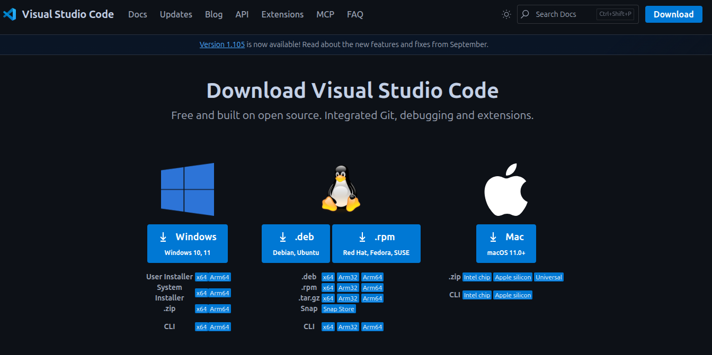

    - Una vez descargado dependiendo de el sistema elegido haremos los siguiente:
    - **En linux:**
        - Nos dirigiremos a la terminal y ejecutaremos el siguiente comando
        ```bash
        sudo apt install ./ruta_archivo_descargado/nombre_archivo_descargado
        ```
        - Introduciremos la contraseña y ya se estará instalando

    - **En Windows:**
        - Nos dirigiremos a donde tengamos instalado el archivo de instalacion y lo abriremos
        - Despues aceptaremos los terminos y condiciones le daremos a siguiente y empezaremos con la instalacion:

            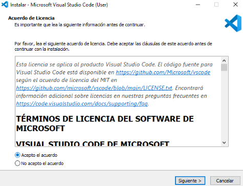

- Para instalar fleet primero deberemos de instalar jetbrains toolbox, podremos hacerlo desde el siguiente [enlace](https://www.jetbrains.com/es-es/toolbox-app/), una vez descargado depende del sistema haremos los siguiente:

    - **En linux:**

        - Haremos algo parecido a visual studio code, introduciremos el siguiente comando:
        ```bash
        sudo tar -xvzf ~/ruta_archivo_descargado/nombre_archivo_descargado
        ```

    - **En Windows:**

        - Iremos a donde tengamos el instalador y lo ejecutaremos, aceptaremos los terminos y ya se instalará

    - Una vez vayamos a instalarlo veremos algo asi:

        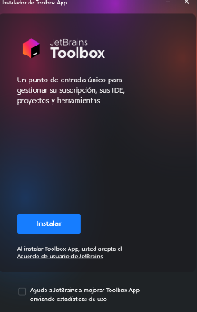
        
        Simplemente le daremos a instalar

    - Luego de esto veremos una ventanita asi:

        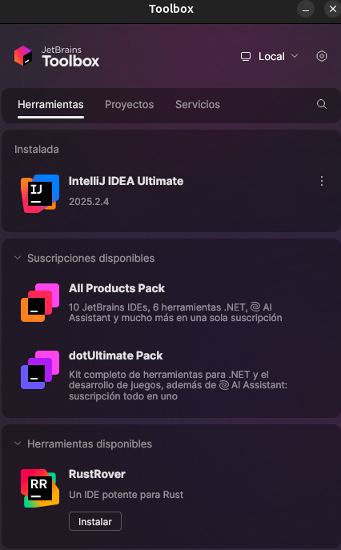

        En la lupa buscaremos el nombre del ide y le daremos a instalar

    - **Preguntas evaluables:**

        - ¿Qué diferencias encontraste en el proceso de instalación entre el IDE propietario y el libre?

            - No hay mucha diferencia notoria en las instalaciones, lo que se podria destacar es que para visual studio code lo haces directamente desde la pagina y ya lo tienes listo y para fleet primero tienes que instalar jetbrains toolbox.

        - ¿Qué ventajas identificaste en cada uno de los entornos durante la instalación?

            - En ambos la instalacion es sencilla, en fleet se podria destacar que si estas familiarizado con los IDEs de jetbrains se te puede hacer más sencillo adaptarte.

## 2.2. Gestión de módulos y extensiones en el entorno de desarrollo (CE 2.b)

- Las extensiones instaladas en los IDEs fueron las siguientes:

    - En VSCode se instalaron las extensiones de python y otras más como pueden ser vscode-pdf, error lens, pylint, etc...

        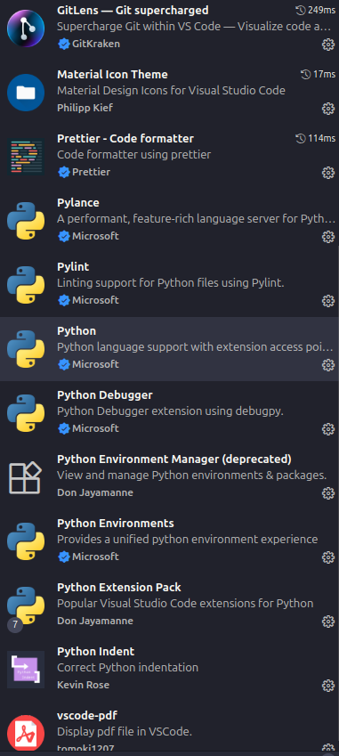

    - En Fleet las extensiones ya vienen integradas con el IDE

        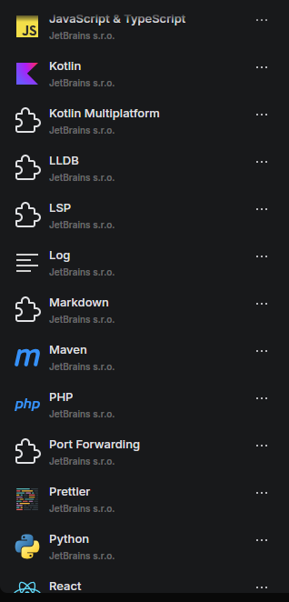


    - **Preguntas evaluativas:**

        - ¿Cómo fue el proceso de instalación de extensiones o módulos en cada IDE?

            - En Visual Studio Code debemos de dirigirnos al apartado de extensiones y alli buscar las extensiones que deeseemos, en cambio, en fleet las extensiones disponibles ya vienen preinstaladas cuando instalas el IDE

        - ¿Qué beneficios proporcionan las extensiones o plugins que instalaste para el desarrollo de tus proyectos?

            - En Visual Studio Code he instalado algunas como Error lens que te mejora los mensajes de error, avisos, etc... Prettier para un mejor formateo del codigo, Paquete de extension python para poder hacer uso del lenguaje.

            - En Fleet hay diferentes extensiones para diversos idiomas como Python, Kotlin, Java, C, etc, tambien tiene instalado prettier al igual que Visual Studio Code

## 2.3. Personalización y automatización del entorno (CE 2.c)

- Personalizaciones entornos:

    - Antes

        - Visual Studio Code

            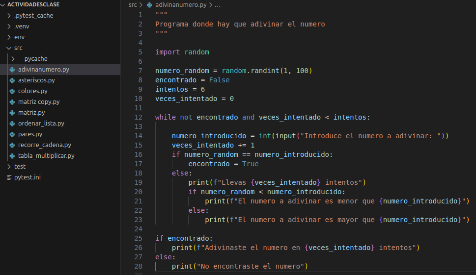

        - Fleet: 
            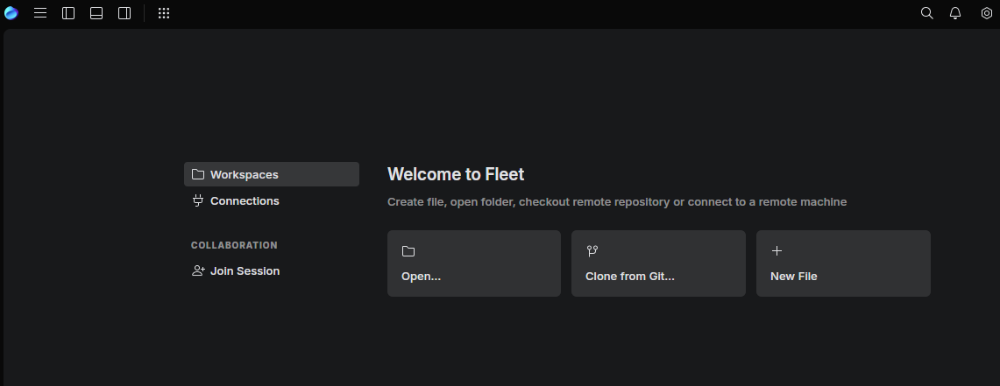

    - Despues: 
        - Visual Studio Code
            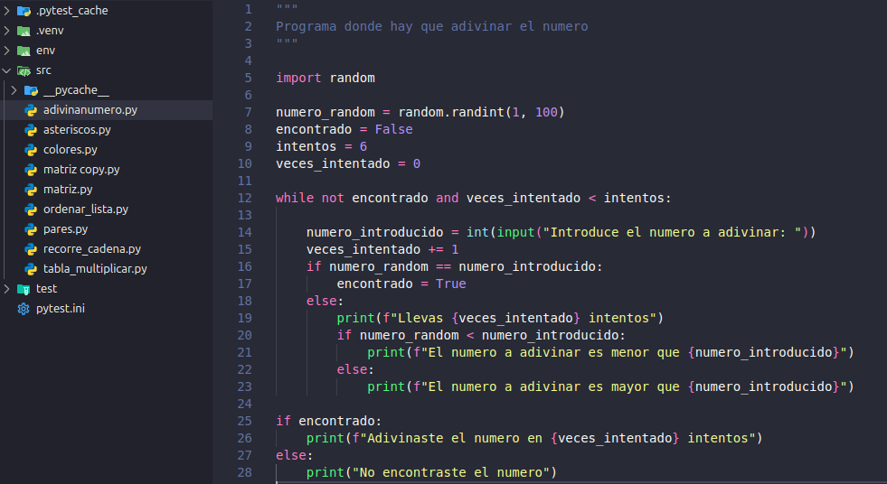

        - Fleet:
            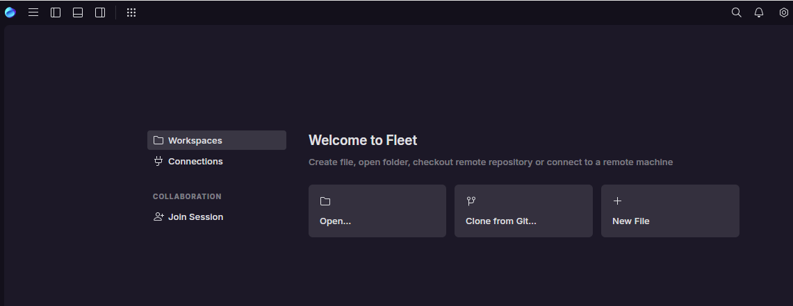


- Autoguardado:

    - Configurado para que cuando dejo de escribir se guarde el archivo automaticamente
    
        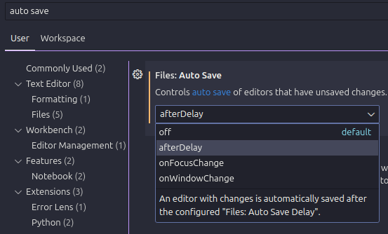

- **Preguntas evaluativas:**

    - ¿Qué aspectos del entorno personalizaste y cómo mejoró tu experiencia de desarrollo?

        - He personalizado aspectos como pueden ser el tema, iconos o tareas. Esto ha mejorado mi experiencia de desarrollo de forma que visualmente se vea mejor, más facil de diferencias las cosas y ayuda en el desarrollo

    - ¿Cómo configuraste la automatización de tareas y en qué te benefició durante el trabajo?

        - He configurado que se autoguarden los cambios que hago en los ficheros de forma que no tenga que guardarlos yo manualmente

## 2.4. Configuración del sistema de actualización del entorno de desarrollo (CE 2.d)


## 2.5. Generación de ejecutables a partir de código fuente en distintos lenguajes en un mismo IDE (CE 2.e)


## 2.6. Generación de ejecutables con diferentes IDEs a partir del mismo código fuente (CE 2.f)
